# Amazon RDS Project – Build Your DB Server & Interact with App

**Date:** May 2025  

---

## 📌 Introduction
In this project, I worked with **Amazon Relational Database Service (RDS)** to deploy and configure a relational database in the cloud.  
The lab demonstrates how to launch an RDS instance, configure security groups and subnet groups, connect it with a web server, and interact with the database using a sample web application.  

---

## 🎯 Objectives
By the end of this lab, I was able to:  
- Create a **DB Security Group** to allow inbound access from a web server.  
- Configure a **DB Subnet Group** across multiple Availability Zones.  
- Launch a **MySQL RDS DB instance** with Multi-AZ deployment.  
- Connect a web application hosted on EC2 to the RDS database.  
- Interact with the database using the app (add, edit, and delete records).  

📷 *RDS Overview:*  

At the beginning of this project, I will build the following infrastructure:  

📷 *Planned Infrastructure (Before Building DB):*  
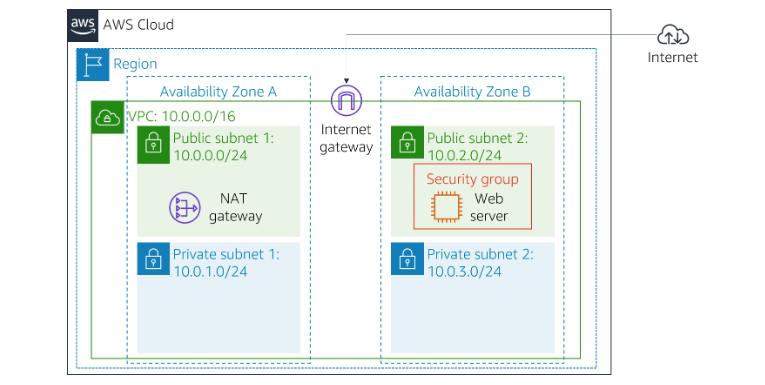

After that, I will extend the setup by creating an RDS database and connecting it with the web server, so the architecture evolves into:  

📷 *Final Infrastructure (With RDS Database):*  

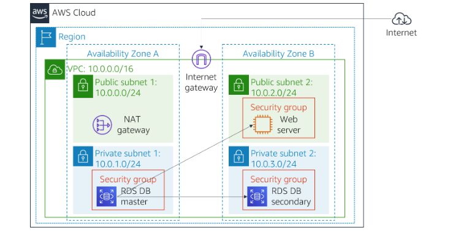

---

## ☁️ AWS Services Used
- **Amazon RDS (MySQL)**  
- **Amazon VPC**  
- **Amazon EC2**  
- **Security Groups**  
- **DB Subnet Groups**  

---

## 🛠️ Project Execution

### **Task 1: Create a Security Group for RDS**
- Created a security group named **DB Security Group**.  
- Configured inbound rules to allow MySQL/Aurora (port **3306**) traffic from **Web Security Group**.  

📷 *DB Security Group Created:*  
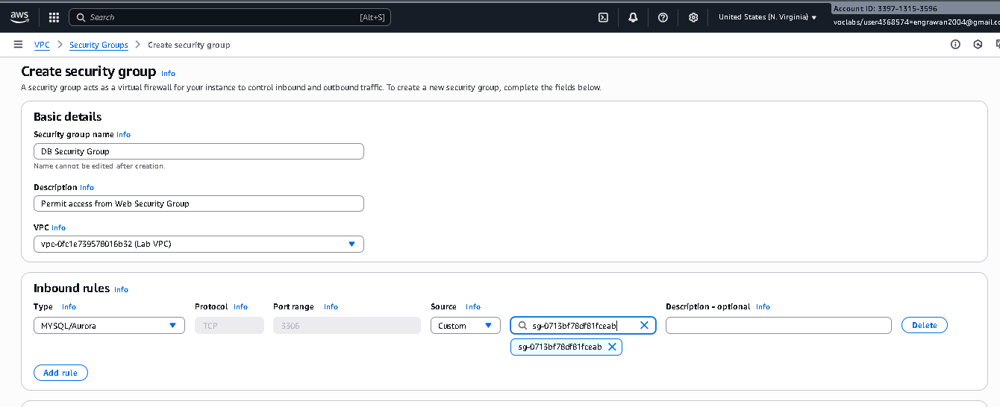

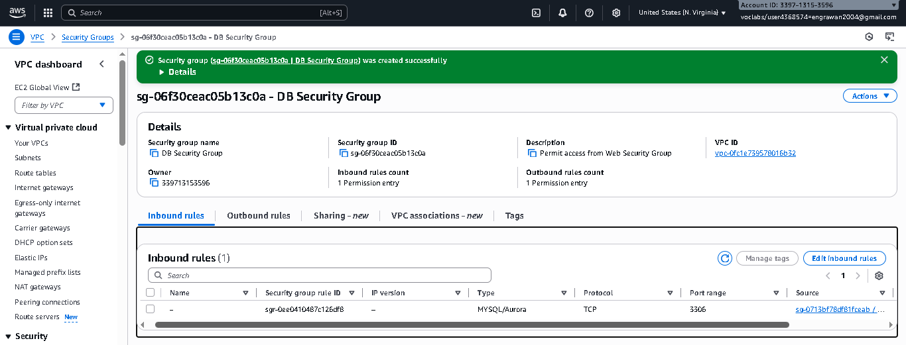

---

### **Task 2: Create a DB Subnet Group**
- Created subnet group named **DB-Subnet-Group**.  
- Selected **Lab VPC**.  
- Added subnets from **us-east-1a** and **us-east-1b** (`10.0.1.0/24` and `10.0.3.0/24`).  

📷 *DB Subnet Group:*  
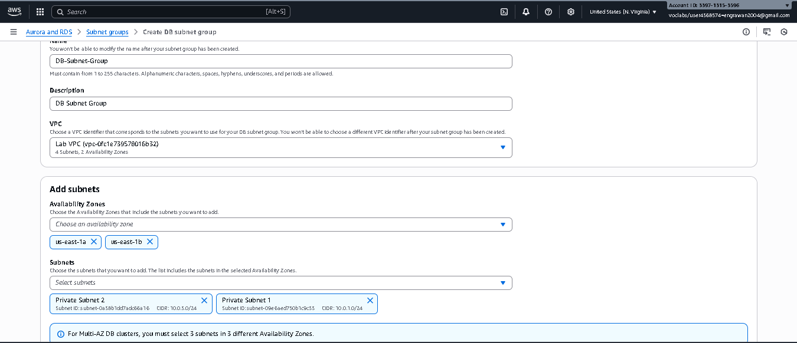
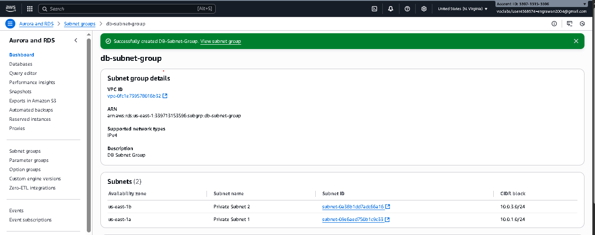

> 📝 **Note:**  
> RDS requires a **DB Subnet Group** (not a single subnet) because it needs subnets in at least **two Availability Zones**.  
> This ensures **high availability** and **automatic failover** by placing the primary DB in one AZ and a standby in another.

---

### **Task 3: Launch RDS DB Instance**
- Chose **MySQL** engine.  
- Template: **Dev/Test**.  
- Availability: **Multi-AZ Deployment**.  
- DB Identifier: `lab-db`.  
- Master Username: `main`.  
- Master Password: `lab-password`.  
- Instance class: `db.t3.micro`.  
- Storage: **20 GiB (gp2 SSD)**.  
- Disabled **Enhanced Monitoring**, **automatic backups**, and **encryption** (for lab speed).  
- Associated with **DB Security Group**.  

📷 *RDS DB Instance Launch Configuration:*  
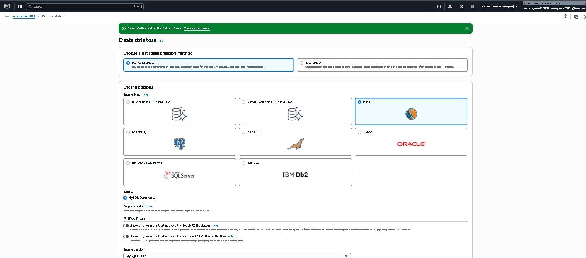

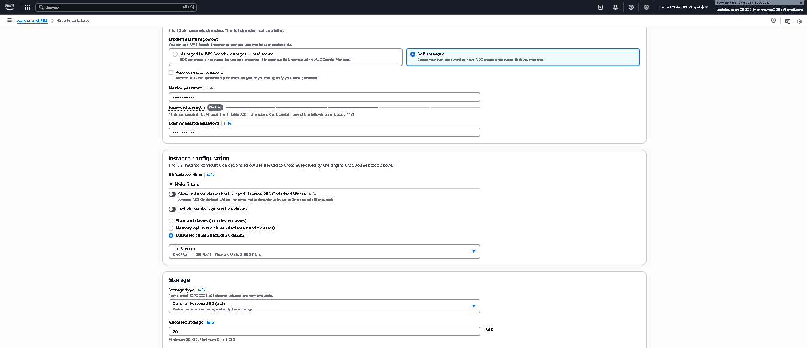

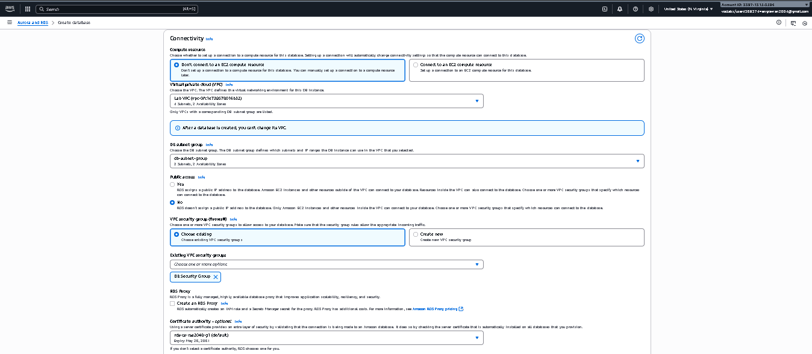

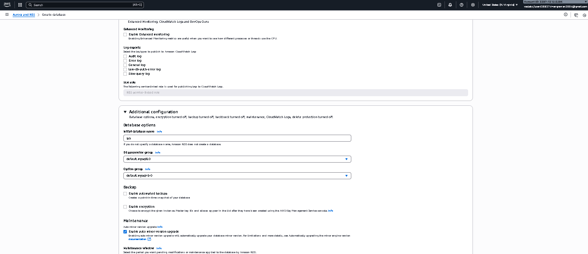

📷 *DB Instance Status:*  
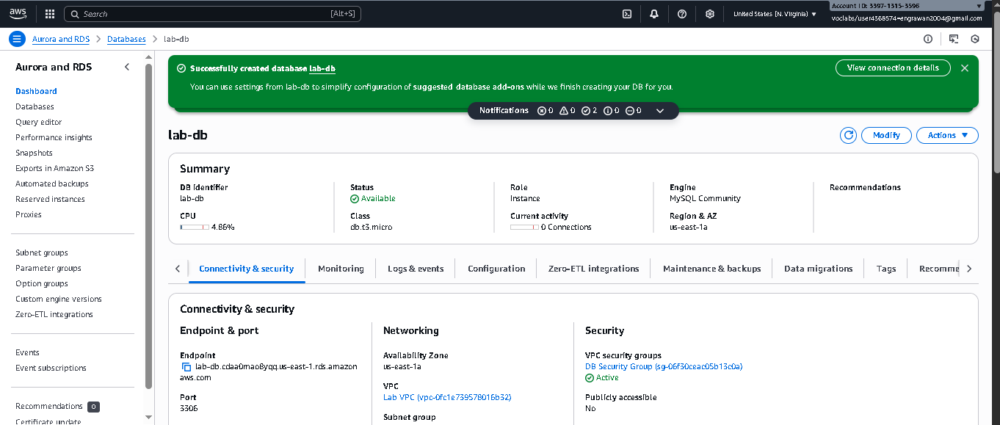

> 📝 **Note:**  
The **Endpoint** (e.g., `lab-db.cdaa0mao8yqq.us-east-1.rds.amazonaws.com`) was copied for later use to connect the web application.

---

### **Task 4: Interact with Database via Web App**
- Retrieved **WebServer IP address** from AWS lab details`13.223.175.114`.  
- Accessed the web app in the browser.  
- Chose **RDS** link in the app.  
- Configured DB connection:  
  - **Endpoint**: RDS Endpoint copied earlier.  
  - **Database**: `lab`  
  - **Username**: `main`  
  - **Password**: `lab-password`  

📷 *Web App Connection Setup:*  
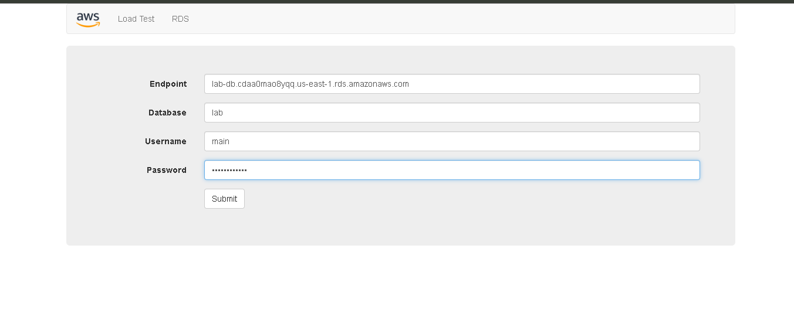
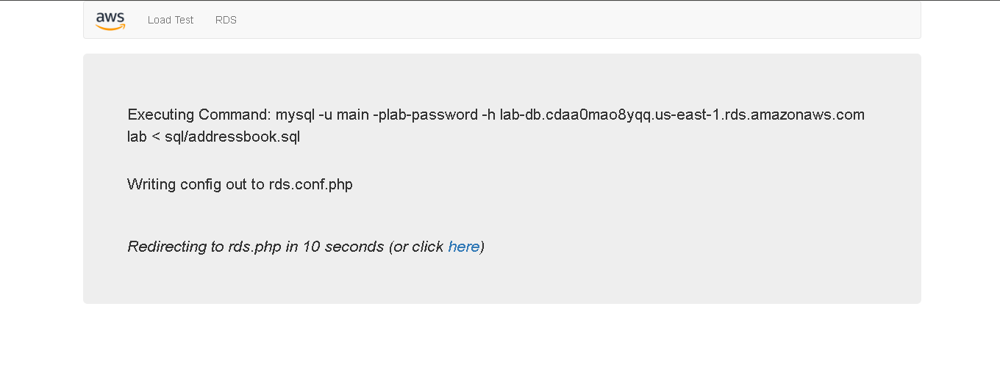

- Verified the **Address Book App** connected successfully to RDS.  
- Tested **Add, Edit, and Delete** contacts.  

📷 *Address Book App with RDS:* 
    *Before Adding*
    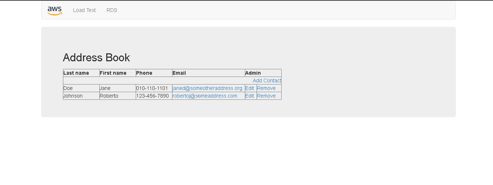
    *After Adding*
    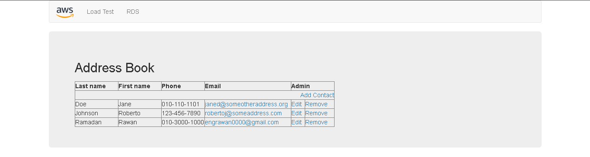

---

## 👩‍💻 Author
*Developed and documented by [Rawan Ramadan]*  
